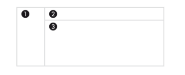

https://activecollab.com/
=========
:wink: je vous laisse deviner la consigne 
il est pas mal ce site, bien responsive
sur github le 3 janvier être il devra :wink:
la première page uniquement

EXERCICE - HTML
========

Test 1 :
--
Créer deux paragraphes d’une hauteur de 300 pixels et d’une largeur de 700
pixels. Y inclure un texte très long et gérer son débordement afin qu’il soit
entièrement lisible.

Test 2 :
---
Créer cinq titres de niveau 2 et les afficher sous forme de liste (voir la propriété
display).

Test 3 :
---
Dans un élément 
, inclure un élément  contenant du texte et lui
donner le style bloc.

Test 4 :
--
Créer un menu vertical dont les éléments sont des liens <a/>.

Test 5 :
--
Créer une image contenant un paragraphe incluant du texte et deux éléments
	 qui se suivent. Faire flotter les images, la première à gauche et la
seconde à droite. 

> hum, hum, hum dans l'image t'as deux images côte à côte + du texte...   
> donc soit on joue avec des relatifs soit on background tout ça, ou pas?  
> yo no sé que hacer  

Test 6 :
--
Placer trois images de tailles initiales différentes dans une page. Écrire les styles
pour qu’elles s’affichent avec la même taille. Ensuite, positionner afin d’obtenir
un effet de cascade avec un décalage horizontal et vertical constant pour chaque
image par rapport à la précédente. L’utilisateur doit pouvoir mettre chacune
d’elles au premier plan en passant la souris dessus (voir la propriété z-index).

Test 7 :
--
Créer une mise en page à trois colonnes de largeurs respectives 20%, 65% et 15%.
La première et la troisième doivent contenir respectivement un menu et une liste
de liens crées à partir d’images. La colonne centrale doit posséder un contenu
éditorial.

Test 8 :
--
Créer une mise en page selon le modèle de la figure ci-dessous:
La colonne de gauche (repère 1) a une largeur de 200 pixels et le bandeau (repère
2) une hauteur de 150 pixels. Le bandeau contient le titre du site, la colonne de
gauche un menu de la zone principale (repère 3) du texte et des images au choix.
Le premier lien du menu doit afficher une page ayant la même structure et le
même contenu dans les zones 1 et 2, mais un contenu éditorial différent dans la
zone 3. (edited)

Les plus téméraires peuvent directement s’attaquer à la reproduction des gabarits
======
de ce site sans regarder le CSS:
http://www.alsacreations.com/static/gabarits/liste.html
Attention, il ne s’agit pas de reproduire l’icone mais bien toute la page du gabarit
!

